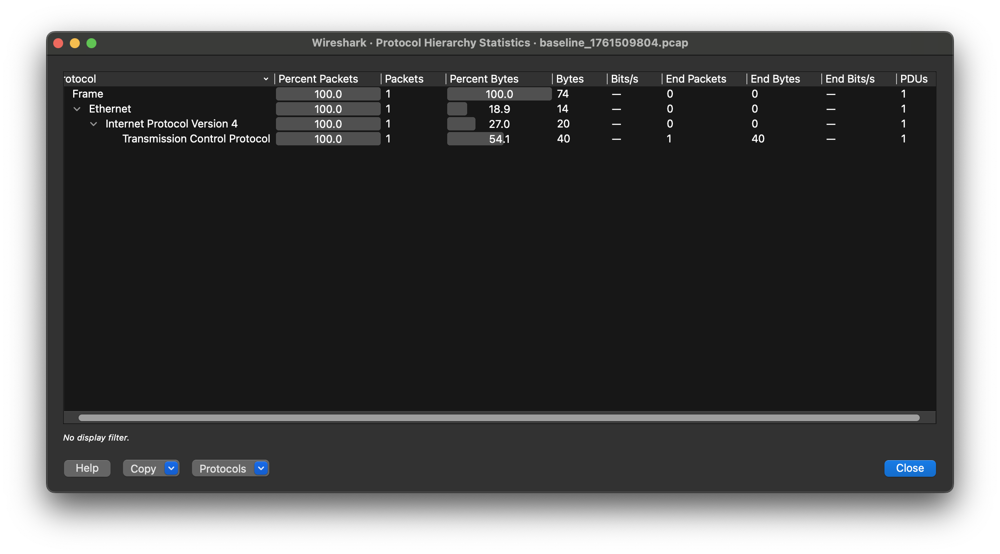

# Network Traffic Analysis & Attack Detection — Lab Report

**Author:** Yuliia Ieremii 
**Role:** 2nd‑year National Security — Cybersecurity student  
**Environment:** macOS, Docker Desktop, python:3.11-slim (victim/attacker), nicolaka/netshoot (monitor)  
**Date:** October 26, 2025

---

## Project summary
This lab implements an isolated Docker-based environment to capture and analyze network traffic, simulate simple network anomalies, and demonstrate detection techniques. Two scenarios were simulated:

1. ARP anomaly (conflicting ARP replies — same IP announced by multiple MAC addresses).  
2. Traffic spike resembling DoS behaviour (high request rate to a local HTTP server).

The goal is to show practical skills in network traffic capture, pcap analysis, and incident investigation suitable for a student portfolio.

---

## Environment
- Host OS: macOS (Docker Desktop)  
- Docker services: `victim` (http.server), `attacker` (traffic generator), `monitor` (netshoot/tcpdump)  
- Tools used: tcpdump, Wireshark, Scapy, Python3

## Repository layout (relevant files):

```
cyber-lab/
├─ analysis_arp_conflict.txt
├─ analysis_baseline_new.txt
├─ analysis_baseline.txt
├─ analysis_dos.txt
├─ arp_conflict.pcap
├─ baseline_1761509804.pcap
├─ dos_1761510519.pcap
├─ dos_1761510621.pcap
├─ portfolio/
│  ├─ README.md
│  ├─ REPORT.md
│  └─ screenshots S*.png
├─ scripts/
│  ├─ analyze_pcap.py
│  └─ gen_arp_conflict.py
└─ docker-compose.yml
```
---

## What I did (steps)
1. Built the lab using Docker Compose and verified container connectivity (`victim`, `attacker`, `monitor`).  
2. Captured baseline traffic with `tcpdump` from the monitor container: `baseline_1761509804.pcap`.  
3. Ran a safe ARP conflict simulation (no live spoofing of other networks) by generating a pcap with two ARP replies for the same IP and analyzing it (`arp_conflict.pcap`).  
4. Generated high-rate HTTP traffic from attacker to victim and captured its traffic as `dos_1761510621.pcap`.  
5. Performed automated analysis with `scripts/analyze_pcap.py` and manual inspection in Wireshark (protocol hierarchy, conversations, IO Graphs, SYN filter).

---

## Key findings
- **ARP anomaly:** The ARP simulation shows the same IP announced by two different MAC addresses — an indicator that should trigger ARP monitoring and either manual investigation or automated alerts. (See `arp_conflict.pcap`, screenshot `S7_arp_list.png`)  
- **Traffic spike (DoS‑like):** The `dos_1761510621.pcap` shows a clear packets/sec spike and concentrated SYN packets from one host, consistent with high-rate connection attempts. This pattern can be detected by threshold-based IDS rules or rate-limiting. (See `S9_iograph_dos.png`, `S9_syn_filter.png`, and `analysis_dos.txt`.)

---

## Evidence & Screenshots

<figure>
  
  <figcaption><strong>Figure S2.</strong> Docker: running containers — victim, attacker, monitor. This verifies the lab topology.</figcaption>
</figure>

<figure>
  
  <figcaption><strong>Figure S4.</strong> tcpdump running in the monitor container — capturing raw traffic to /captures/.</figcaption>
</figure>

<figure>
  
  <figcaption><strong>Figure S4a.</strong> Baseline PCAP saved on host (ls -lh) — file size confirms recorded data.</figcaption>
</figure>

<figure>
  
  <figcaption><strong>Figure S5.</strong> Protocol Hierarchy — shows distribution of protocols in the baseline capture.</figcaption>
</figure>

<figure>
  
  <figcaption><strong>Figure S5b.</strong> IPv4 Conversations — top talkers and byte counts for baseline traffic.</figcaption>
</figure>

<figure>
  
  <figcaption><strong>Figure S5c.</strong> IO Graph (packets/sec) for baseline capture.</figcaption>
</figure>

<figure>
  
  <figcaption><strong>Figure S7.</strong> ARP replies showing the same IP announced by different MAC addresses — ARP anomaly simulation.</figcaption>
</figure>

<figure>
  
  <figcaption><strong>Figure S9.</strong> IO Graph showing the traffic spike during the high-request simulation (DoS-like).</figcaption>
</figure>

<figure>
  
  <figcaption><strong>Figure S9b.</strong> Display filter: TCP SYN packets (`tcp.flags.syn == 1 && tcp.flags.ack == 0`) — many SYNs from a single source.</figcaption>
</figure>

<figure>
  
  <figcaption><strong>Figure P1.</strong> Output of `analyze_pcap.py` — shows top talkers and SYN counts for the capture.</figcaption>
</figure>

---

## Artifacts included
- `docker-compose.yml` — environment definition.  
- `captures/` — PCAP files collected during the lab.  
- `scripts/analyze_pcap.py` — Python script (Scapy) that:
  - finds IPs with multiple MACs in ARP replies,
  - lists top talkers by packet count,
  - counts SYN packets per source IP.  
- `portfolio/README.md` — reproduction instructions.  
- Screenshots `S*.png` showing environment setup, captures and Wireshark evidence.  
- `analysis_dos.txt` — output of `analyze_pcap.py`.

---

## Detection & mitigation recommendations
- **ARP anomalies:** deploy ARP monitoring tools (e.g., `arpwatch`), enable port security (MAC binding) on switches, and consider Dynamic ARP Inspection where supported.  
- **High-rate connection attempts:** create IDS/IPS rules (Suricata/Snort) to detect sudden increases in packets/sec and excessive SYNs; implement rate-limiting and connection throttling at the application edge; enable connection tracking and blacklisting for obvious sources.  
- **Operational:** centralize packet capture storage for investigations, keep capture metadata (timestamps, capture host, commands used) and maintain ethical/chain-of-custody notes.

---

## Reproducible commands (select)
Start environment:

```bash
docker compose up -d
docker ps
```

Capture(example):

```bash
# in monitor
tcpdump -i eth0 -s 0 -U -w /captures/baseline_<ts>.pcap
# on host: generate traffic from attacker
docker exec attacker bash -c "for i in $(seq 1 2000); do curl -sS http://victim:8000/ > /dev/null & done; wait"
```
Analyze:

```bash
pip3 install --user scapy
python3 scripts/analyze_pcap.py captures/baseline_<ts>.pcap | tee captures/analysis_baseline.txt
```
>Ethical statement: All tests were executed inside an isolated Docker network on the author’s machine. No external networks or third-party systems were targeted.